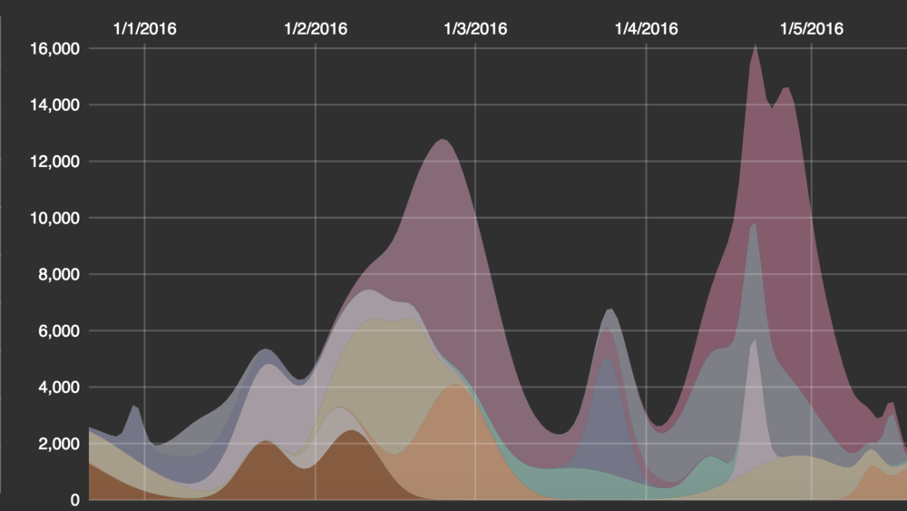
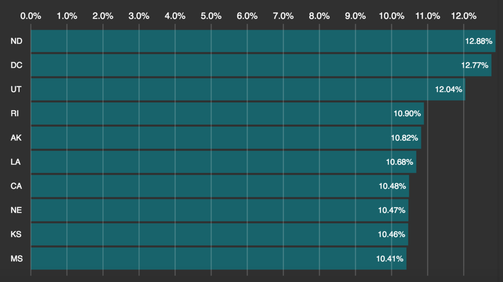

<h2>React D3 Chart Transitions</h2>
<h4>A Pattern for smooth D3 transitions in React with no contention over the DOM</h4>

There is no use of React's findDOMNode or D3's select or selectAll in these examples. In fact, D3 selection code is not even bundled in the build. React is in control of what is in the DOM and D3 interpolators handle transitions between states.

The repo contains several examples of using React 15.0 in conjunction with the new D3 4.0 ES6 modules.  To make it clear what the dependencies are, each example is a mini Redux app that you can check out locally using the instructions below.

<strong>For the moment I consider these prototypes. Comments, suggestions and criticism are welcome!!</strong>

<h2>Installation:</h2>
The only assumptions are that you have Webpack and ES Lint (not really "required") installed globally...
```html
npm install webpack eslint -g
```

<h2>Run the examples:</h2>
<h3>Stacked Chart Example</h3>

```html
Download the repo...

$ cd examples/stackedChartExample
$ npm install
$ webpack
$ python -m SimpleHTTPServer 7070 (on Mac or use your favorite local server!)

Go to http://localhost:7070/
```

For better performance you can use the production webpack config...
```html
$ webpack --config webpack.prod.config.js --progress --profile --colors
```
<strong>Hint: </strong>For even better performance you can remove the redux-logger from store.js

<h3>Bar Chart Example</h3>

```html
Download the repo...

$ cd examples/barChartExample
$ npm install
$ webpack
$ python -m SimpleHTTPServer 7070 (on Mac or use your favorite local server!)

Go to http://localhost:7070/
```

For better performance you can use the production webpack config...
```html
$ webpack --config webpack.prod.config.js --progress --profile --colors
```
<strong>Hint: </strong>For even better performance you can remove the redux-logger from store.js

<h3>Alphabet Example</h3>

```html
Download the repo...

$ cd examples/alphabetExample
$ npm install
$ webpack
$ python -m SimpleHTTPServer 7070 (on Mac or use your favorite local server!)

Go to http://localhost:7070/
```

For better performance you can use the production webpack config...
```html
$ webpack --config webpack.prod.config.js --progress --profile --colors
```
<strong>Hint: </strong>For even better performance you can remove the redux-logger from store.js


